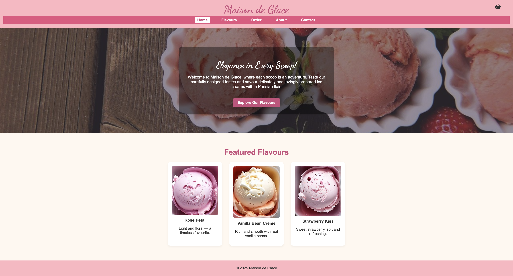

# Maison de Glace 🍨

A clean, responsive **ice-cream shop** website built with **HTML & CSS**.


**Live demo:** https://sneha05githb.github.io/IceCream-WebsiteMaisonDeGlace/  
**Repo:** https://github.com/sneha05githb/IceCream-WebsiteMaisonDeGlace

##  Features
- Responsive layout for mobile & desktop
- Menu pages (flavours, basket, order)
- Contact page & basic site navigation
- Hero section with imagery

##  Tech Stack
- HTML5
- CSS3 (flex/grid)

##  Project Structure
├── images/ # image assets
├── index.html # home page
├── about.html
├── flavours.html
├── basket.html
├── order.html
├── contact.html
└── style.css

---

## Run Locally
No setup needed.  
Just clone the repository and open `index.html` in your browser.

```bash
git clone https://github.com/sneha05githb/IceCream-WebsiteMaisonDeGlace.git
cd IceCream-WebsiteMaisonDeGlace
open index.html

